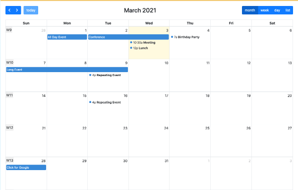

#  lib_FullCalendar

# This is the FullCalendar Library for Convertigo Low Code studio
Use this library to provide Calendar with multiple views to your applications. the library is based on the FullCalendar component https://fullcalendar.io/

<i>Connectors</i>
<blockquote>

##  void

void connector, replace or don't use it

<i>Transactions</i>
<blockquote>

###  void

does nothing

</blockquote>

</blockquote>

<i>Mobile Application</i>
<blockquote>

##  Application

Describes the mobile application global properties

<i>Pages</i>
<blockquote>

###  Page

My First Page as root page

</blockquote>

<i>Shared Components</i>
<blockquote>

###  FullCalendar

FullCalendar providing Calendar, planning and schedules

Variables

<table>
<tr>
<th>
name
</th>
<th>
comment
</th>
</tr>
<tr>
<td>
&nbsp;buttonText
</td>
<td>
A JSON Object representing the Button labels 
<pre>
{
  today:    "Today",
  month:    'month',
  week:     'week',
  day:      'day',
  list:     'list'
}
</pre>

</td>
</tr>
<tr>
<td>
&nbsp;calEvents
</td>
<td>
The initial events to be displayed in the calendar. An array of event objects of this structure :
<pre>
{
  id: 'a',
  title: 'my event',
  start: '2018-09-01'
}
</pre>
See Event documentation for details : https://fullcalendar.io/docs/event-object

Note that when a user resizes or modifies an event, this array will be automatically updated if you use two way binding.

</td>
</tr>
<tr>
<td>
&nbsp;editable
</td>
<td>
Enables the user to edit events can be true or false
</td>
</tr>
<tr>
<td>
&nbsp;headerToolbar
</td>
<td>
A JSON Object representing the Header toolbar 
<pre>
{
    left: 'prev,next today',
    center: 'title',
    right: 'dayGridMonth,timeGridWeek,timeGridDay'
}
</pre>

</td>
</tr>
<tr>
<td>
&nbsp;height
</td>
<td>
Sets the height of the entire calendar, including header and footer.

Integer, "auto", a CSS value like "100%"

By default, this option is unset and the calendar’s height is calculated by aspectRatio.

If an integer is specified, the height of the calendar will be guaranteed to be that exact pixel height. If the contents will not fit within the height, scrollbars will appear.

If "auto" is specified, the view’s contents will assume a natural height and no scrollbars will be used.

If "100%" is specified, the height of the calendar will match the height of its parent container element. See an example. Any other valid CSS value is accepted as well.

</td>
</tr>
<tr>
<td>
&nbsp;initialDate
</td>
<td>
The initial date displayed when the calendar first loads.

Date

When not specified, this value defaults to the current date.

This value can be anything that can parse into a Date, including an ISO8601 date string like "2014-02-01".
</td>
</tr>
<tr>
<td>
&nbsp;initialView
</td>
<td>
InitialDisplay such as 'dayGridMonth', 'timeGridWeek', 'listWeek', 'dayGridWeek', 'multiMonthYear'

</td>
</tr>
<tr>
<td>
&nbsp;locale
</td>
<td>
Locale such as 'en', 'fr', 'es' ..
</td>
</tr>
<tr>
<td>
&nbsp;selectable
</td>
<td>
Enables the user to select events can be true or false
</td>
</tr>
</table>

Events

<table>
<tr>
<th>
name
</th>
<th>
comment
</th>
</tr>
<tr>
<td>
&nbsp;DateClicked
</td>
<td>
Triggered when an event is modified by the user, the modified event object will be in the <pre>out</out>

</td>
</tr>
<tr>
<td>
&nbsp;EventChanged
</td>
<td>
Triggered when an event is modified by the user, the modified event object will be in the <pre>out</out>

</td>
</tr>
</table>

</blockquote>

</blockquote>

