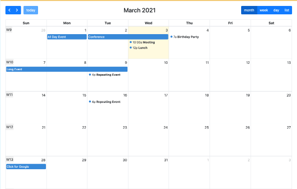

# lib_FullCalendar

# This is the FullCalendar Library for Convertigo Low Code studio
Use this library to provide Calendar with multiple views to your applications. the library is based on the FullCalendar component https://fullcalendar.io/




For more technical informations : [documentation](./project.md)

- [Installation](#installation)
- [Mobile Library](#mobile-library)
    - [Shared Components](#shared-components)
        - [FullCalendar](#fullcalendar)


## Installation

1. In your Convertigo Studio click on  to import a project in the treeview
2. In the import wizard

   
   
   paste the text below into the `Project remote URL` field:
   <table>
     <tr><td>Usage</td><td>Click the copy button at the end of the line</td></tr>
     <tr><td>To contribute</td><td>

     ```
     lib_FullCalendar=https://github.com/convertigo/c8oproj-lib-fullcalendar:branch=master
     ```
     </td></tr>
     <tr><td>To simply use</td><td>

     ```
     lib_FullCalendar=https://github.com/convertigo/c8oproj-lib-fullcalendar/archive/master.zip
     ```
     </td></tr>
    </table>
3. Click the `Finish` button. This will automatically import the __lib_FullCalendar__ project


## Mobile Library

Describes the mobile application global properties

### Shared Components

#### FullCalendar

FullCalendar 7.0.1 Standard wrapper for Convertigo NGX.

Renders an interactive calendar through @fullcalendar/angular with the Classic theme and the bundled DayGrid, TimeGrid, List, MultiMonth and Interaction plugins. Premium Scheduler/resource views are not included.

All public inputs are applied at initialization. locale, initialView, headerToolbar, buttonText, selectable, calEvents, editable, height, initialDate, multiMonthMaxColumns, eventTimeFormat, displayEventEnd, eventMinHeight, eventShortHeight and slotEventOverlap are also handled reactively after initialization.

Styles
The shared component deliberately contains no presentation CSS. The consuming application owns the appearance of events.

The component exposes these stable CSS hooks:
- occupied: every foreground event; retained for compatibility
- c8o-fc-timegrid-event: timed event in TimeGrid week/day views
- c8o-fc-event-inner: event inner container
- c8o-fc-event-time: rendered time text
- c8o-fc-event-title: rendered title

Define rules in a global application UIStyle under Application > NgxApp. The demonstration project provides the dedicated NgxApp.FullCalendarStyle object as a complete copyable example. It is optional and is not embedded in the shared component.

Use an event's color and contrastColor fields for its palette. Use className for application variants such as event--confirmed or event--cancelled. To style only one calendar instance, wrap its UIUseShared control in an application container class and prefix selectors with that class.

Avoid FullCalendar generated fc-classic-* classes. They are internal implementation details; prefer the documented occupied and c8o-fc-* hooks.

See the comment on NgxApp.FullCalendarStyle for installation steps, selector examples and per-event variants.

Outputs:
- DateClicked: emits the native JavaScript Date for a clicked date/time cell.
- EventChanged: emits a plain event object after an event change.
- calEventsChange: supports two-way binding when an editable event is changed.

FullCalendar documentation: https://fullcalendar.io/docs


**variables**

<table>
<tr>
<th>name</th><th>comment</th>
</tr>
<tr>
<td>buttonText</td><td>Compatibility input for toolbar button labels.

FullCalendar 7 removed the legacy buttonText option. This component converts this object into FullCalendar 7 buttons[name].text entries.

Supported generic aliases:
- today -> today
- month -> dayGridMonth
- week -> dayGridWeek and timeGridWeek
- day -> timeGridDay
- list -> listDay, listWeek, listMonth and listYear
- year -> multiMonthYear

Exact button/view names are also accepted, for example:
<pre>
{
  today: 'Today',
  dayGridMonth: 'Month',
  timeGridWeek: 'Week',
  listWeek: 'Agenda'
}
</pre>

Values must be display strings, not full button configuration objects. Reactive: changing this input reapplies the generated buttons option.

Documentation: https://fullcalendar.io/docs/buttons</td>
</tr>
<tr>
<td>calEvents</td><td>Array of FullCalendar event input objects displayed by the calendar.

Common fields:
- id: stable unique identifier
- title: visible label
- start: Date or ISO 8601 value
- end: optional exclusive end Date/ISO value
- allDay: all-day display flag
- editable, color, contrastColor, className and extendedProps: optional event settings

TimeGrid presentation example:
<pre>
{
  id: 'meeting-1',
  title: 'Project meeting',
  start: '2026-07-21T10:00:00',
  end: '2026-07-21T11:30:00',
  color: '#2563eb',
  contrastColor: '#ffffff',
  className: 'event--confirmed',
  extendedProps: {
    location: 'Room 2',
    status: 'confirmed'
  }
}
</pre>

Style-related fields
- color: FullCalendar event background/border palette
- contrastColor: readable foreground color for text and controls
- className: application CSS class attached to the rendered event; write event--confirmed, not .event--confirmed
- extendedProps: application metadata such as status, category or location; metadata is not styled automatically

The component adds occupied to every foreground event and c8o-fc-timegrid-event to timed TimeGrid events. It also exposes c8o-fc-event-inner, c8o-fc-event-time and c8o-fc-event-title on their corresponding child elements.

The shared component supplies no CSS rules for these hooks. Put the rules in a global UIStyle under the consuming application's NgxApp. The demonstration application's FullCalendarStyle object is a copyable example.

Application variant example:
<pre>
full-calendar .event--confirmed {
  border-inline-start-color: #16a34a;
}
</pre>

Do not target generated fc-classic-* classes because they may change with FullCalendar releases.

For editable events, id is required for reliable two-way synchronization. After an eventChange, the component replaces the matching item immutably, emits calEventsChange and emits EventChanged. An unknown id is appended; an event without id only triggers EventChanged and cannot be synchronized into this array.

Replacing the input array reactively updates FullCalendar. Prefer a new array reference when changing events from the parent application.

Documentation:
https://fullcalendar.io/docs/event-object
https://fullcalendar.io/docs/event-render-hooks</td>
</tr>
<tr>
<td>displayEventEnd</td><td>Controls whether an event end time is displayed. Boolean, default: true.

The end is shown only when the event has an end value and event time text is enabled. In narrow or short TimeGrid events FullCalendar may compact the presentation.

Reactive: changing this input after initialization calls Calendar::setOption('displayEventEnd', value).

Documentation: https://fullcalendar.io/docs/displayEventEnd</td>
</tr>
<tr>
<td>editable</td><td>Controls whether calendar events can be modified by the user. Boolean, default: true.

When enabled, FullCalendar permits event dragging and duration resizing where supported by the active view. Individual events can override this setting with editable, startEditable or durationEditable.

A completed modification triggers EventChanged. With a stable event id, it also updates calEvents and emits calEventsChange.

Reactive: changing this input after initialization calls Calendar::setOption('editable', value).

Documentation: https://fullcalendar.io/docs/editable</td>
</tr>
<tr>
<td>eventMinHeight</td><td>Minimum height in pixels for timed events in TimeGrid views. Number, default: 28.

A larger minimum improves title and time legibility for short events, but can increase visual overlap when many events occur close together.

Reactive: changing this input after initialization calls Calendar::setOption('eventMinHeight', value).

Documentation: https://fullcalendar.io/docs/eventMinHeight</td>
</tr>
<tr>
<td>eventShortHeight</td><td>Height threshold in pixels below which a TimeGrid event uses FullCalendar short-event layout. Number, default: 36.

Keep this value greater than or equal to eventMinHeight. The built-in typography is designed for the default 28/36 combination.

Reactive: changing this input after initialization calls Calendar::setOption('eventShortHeight', value).

Documentation: https://fullcalendar.io/docs/eventShortHeight</td>
</tr>
<tr>
<td>eventTimeFormat</td><td>Date-format object used for the time text displayed inside events.

Default: 24-hour hours and minutes. With displayEventEnd enabled, a timed event is rendered as a range such as 10:00 - 11:30 when enough space is available.

Example:
<pre>{ hour: '2-digit', minute: '2-digit', hour12: false }</pre>

Reactive: changing this input after initialization calls Calendar::setOption('eventTimeFormat', value).

Documentation: https://fullcalendar.io/docs/eventTimeFormat</td>
</tr>
<tr>
<td>headerToolbar</td><td>FullCalendar header toolbar definition. Use left/center/right or start/center/end sections.

Example:
<pre>
{
  left: 'prev,next today',
  center: 'title',
  right: 'dayGridMonth,timeGridWeek,listWeek'
}
</pre>

Toolbar tokens include title, prev, next, prevYear, nextYear, today and exact view names.

Important FullCalendar 7 syntax:
- comma-separated tokens are rendered as adjacent buttons;
- space-separated tokens are rendered as separate groups with a gap;
- do not insert a space immediately after a comma, otherwise an empty toolbar item can be rendered.

Use an empty string for an empty section. FullCalendar also accepts false to hide the toolbar.

Reactive: changing this input after initialization calls Calendar::setOption('headerToolbar', value).

Documentation: https://fullcalendar.io/docs/headerToolbar</td>
</tr>
<tr>
<td>height</td><td>Height of the complete calendar, including its toolbar. Default: '100%'.

Accepted values:
- integer: fixed pixel height
- 'auto': natural content height without internal scrollbars
- percentage or another valid CSS size such as '100%' or '600px'

With '100%', the parent container must itself have a resolved height.

Reactive: changing this input after initialization calls Calendar::setOption('height', value).

Documentation: https://fullcalendar.io/docs/height</td>
</tr>
<tr>
<td>initialDate</td><td>Date initially displayed by the calendar.

Accepted values include a native JavaScript Date and values FullCalendar can parse, such as the ISO 8601 string '2026-07-21'. When empty or omitted, FullCalendar uses the current date.

Reactive: changing this input after initialization calls Calendar::gotoDate(value). Empty, null and undefined updates are ignored by gotoDate.

This controls the visible date, not the dates stored in calEvents.

Documentation: https://fullcalendar.io/docs/initialDate</td>
</tr>
<tr>
<td>initialView</td><td>Exact FullCalendar view name displayed when the calendar starts. Default: 'dayGridMonth'.

Bundled view examples:
- dayGridMonth, dayGridWeek
- timeGridWeek, timeGridDay
- listDay, listWeek, listMonth, listYear
- multiMonthYear

The corresponding plugin must be bundled. This component includes DayGrid, TimeGrid, List and MultiMonth.

Reactive: changing this input after initialization calls Calendar::changeView(value).

Documentation: https://fullcalendar.io/docs/initialView</td>
</tr>
<tr>
<td>locale</td><td>FullCalendar locale code or locale object. Default: 'en'.

Examples: 'en', 'fr', 'es', 'pt-br'. The locale affects month/day names, date formatting, button defaults, first day of week and other regional settings. The requested locale must be available to the generated application.

Reactive: changing this input after initialization calls Calendar::setOption('locale', value).

Custom labels supplied through buttonText take precedence for the mapped toolbar buttons.

Documentation: https://fullcalendar.io/docs/locale</td>
</tr>
<tr>
<td>multiMonthMaxColumns</td><td>Maximum number of month columns attempted by the MultiMonth view. Number, default: 3.

This option applies to views such as multiMonthYear. FullCalendar may automatically use fewer columns when the available width is insufficient. Set 1 to force a single vertical column of months.

The MultiMonth plugin is bundled by this component.

Reactive: changing this input after initialization calls Calendar::setOption('multiMonthMaxColumns', value).

Documentation: https://fullcalendar.io/docs/multiMonthMaxColumns</td>
</tr>
<tr>
<td>selectable</td><td>Enables FullCalendar date/time selection. Boolean, default: true.

When enabled, users can select date ranges and selectMirror is enabled by this component. The Interaction plugin is bundled.

Current wrapper limitation: no range-selection output is exposed. DateClicked emits individual date/time clicks only. Add a dedicated select callback/output if consumers need the selected range.

Reactive: changing this input after initialization calls Calendar::setOption('selectable', value).

Documentation: https://fullcalendar.io/docs/selectable</td>
</tr>
<tr>
<td>slotEventOverlap</td><td>Controls whether concurrent timed events visually overlap in TimeGrid views. Boolean, default: false.

false keeps concurrent events side by side without covering each other, which favors readability. true allows partial visual overlap and can leave more horizontal width for each event.

This option affects presentation only; eventOverlap separately controls whether drag/resize operations may create overlaps.

Reactive: changing this input after initialization calls Calendar::setOption('slotEventOverlap', value).

Documentation: https://fullcalendar.io/docs/slotEventOverlap</td>
</tr>
</table>

**events**

<table>
<tr>
<th>name</th><th>comment</th>
</tr>
<tr>
<td>DateClicked</td><td>Emitted when the user clicks a date or time cell.

Payload: only the native JavaScript Date from FullCalendar dateClickInfo.date, available in the Convertigo event output (out). The wrapper does not expose dateStr, allDay, jsEvent, dayEl or the current view.

The Interaction plugin required by dateClick is bundled. A click on a day heading in List view does not trigger dateClick.

Documentation: https://fullcalendar.io/docs/dateClick</td>
</tr>
<tr>
<td>EventChanged</td><td>Emitted after FullCalendar reports an eventChange, including drag, resize or an Event API setter update.

Payload: the updated event returned by Event::toPlainObject(). Read it from the Convertigo event output (out).

When the event has a stable id, calEvents is also updated immutably and calEventsChange is emitted for two-way binding. Events without id still emit EventChanged but are not written back into calEvents.

This output is not an event-click notification; it only reports modifications.

Documentation: https://fullcalendar.io/docs/eventChange</td>
</tr>
</table>


